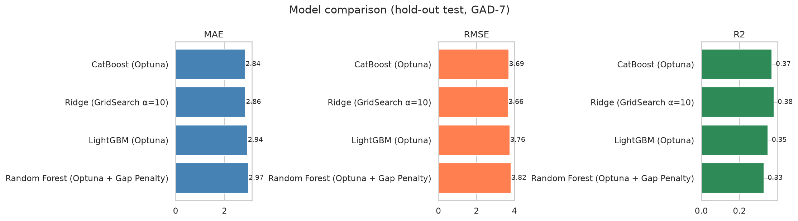
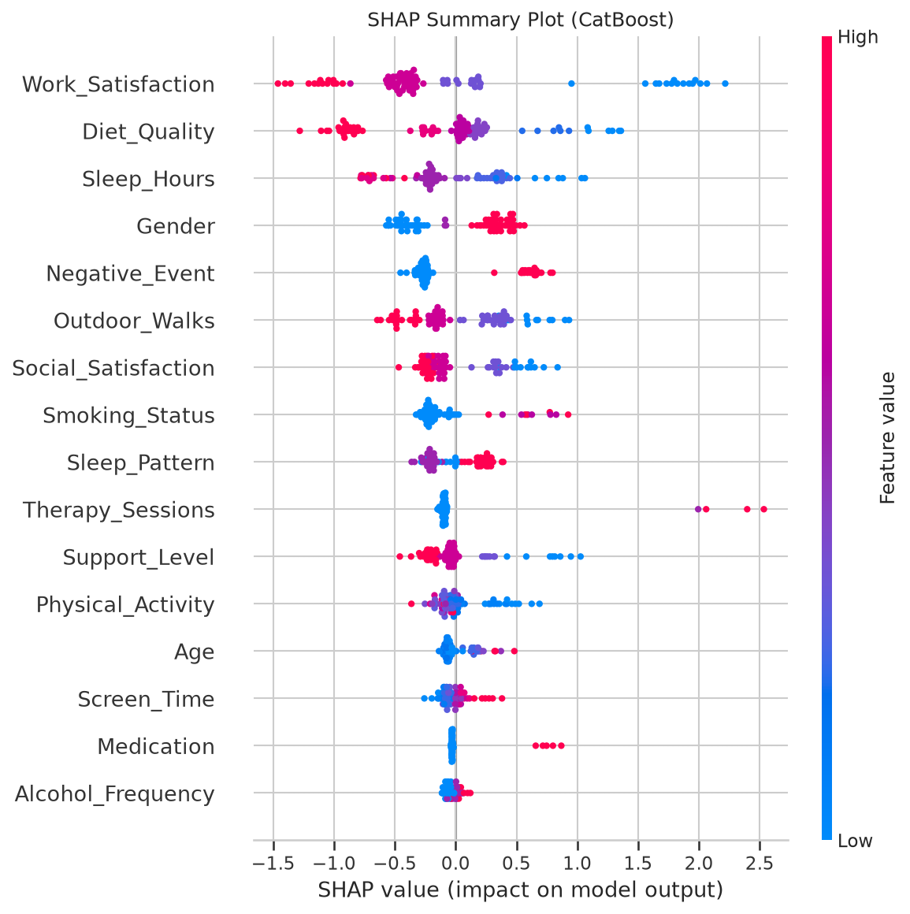
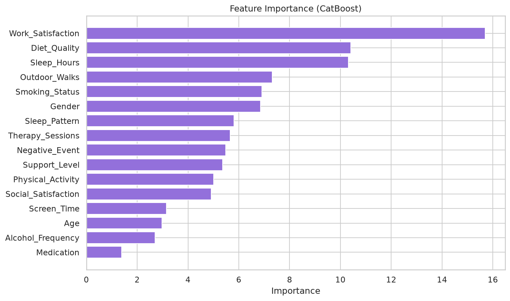
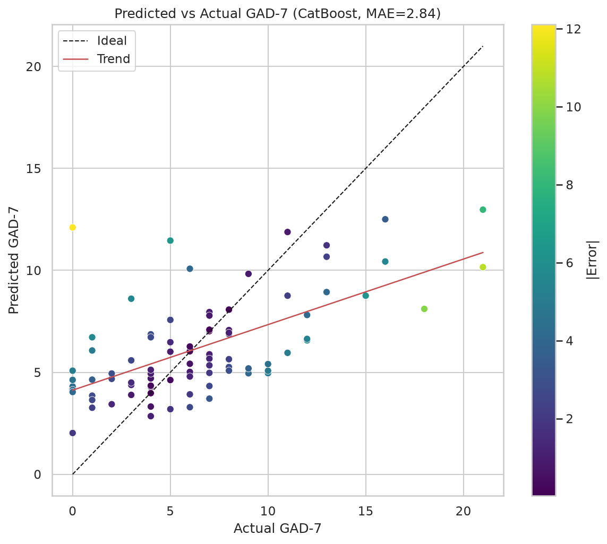
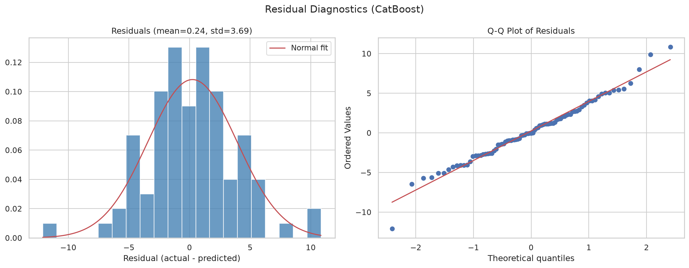
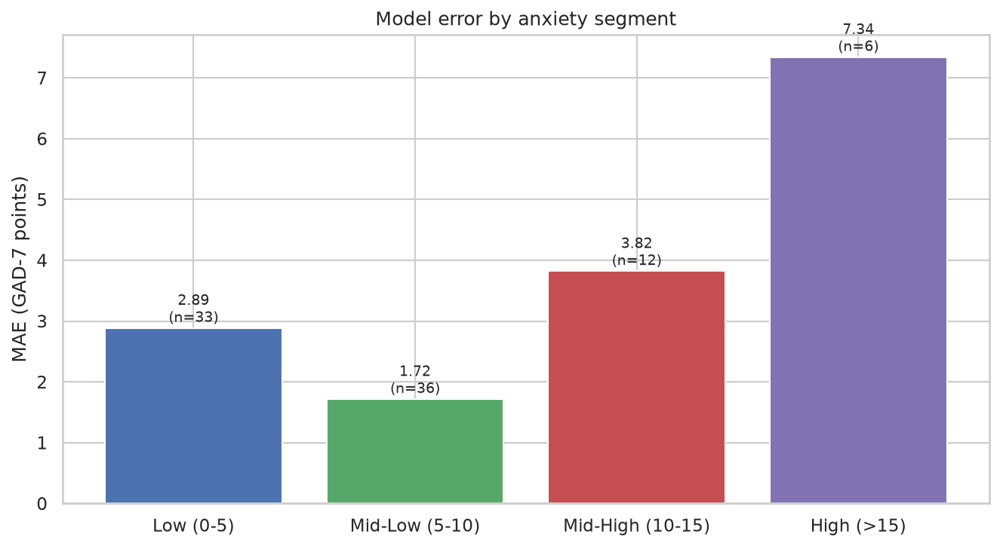
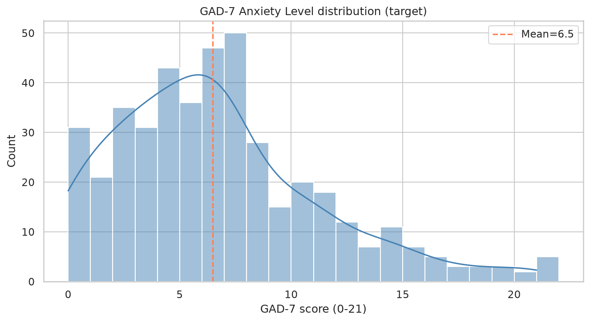
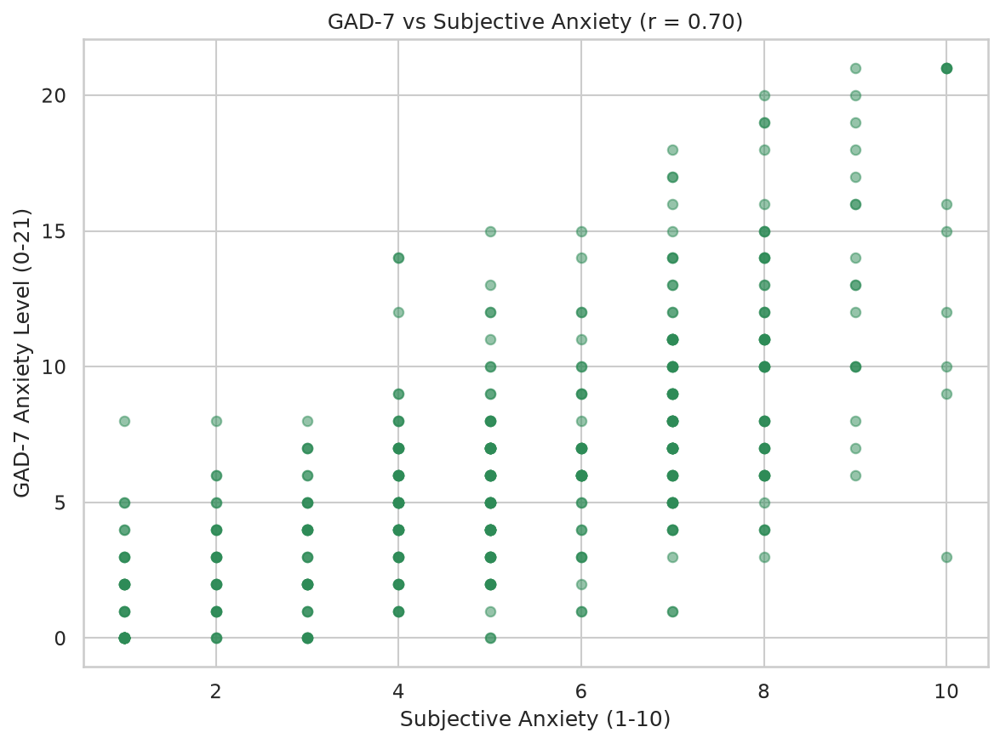

# Anxiety Level ML Research

[](https://dagshub.com/Zerol-91/Stress-Level-ML-Researching.mlflow/#/experiments/0?searchFilter=&orderByKey=attributes.start_time&orderByAsc=false&startTime=ALL&lifecycleFilter=Active&modelVersionFilter=All+Runs&datasetsFilter=W10%3D)
[](https://dagshub.com/Zerol-91/Stress-Level-ML-Researching/experiments)

Machine learning models that estimate a person's anxiety level on the **GAD-7 scale (0–21)** from behavioral and socio-demographic survey answers with *no clinical interview or physiological sensors* required.

The final model (**CatBoost + Optuna**) reaches **MAE 2.79, R² 0.39** on a held-out test set, which is below the GAD-7 *minimal clinically important difference* (MCID, 3–4 points) — making the approach usable as an auxiliary screening/monitoring tool. Results are published in the [12th International Conference BIG DATA and Advanced Analytics (BSUIR, Minsk, 2026)]([https://libeldoc.bsuir.by/bitstream/123456789/63540/4/Lipnickaya_Modeli.pdf](https://libeldoc.bsuir.by/handle/123456789/63540?mode=full)).


## Key results

Four regression algorithms of different natures were compared: the linear **Ridge** baseline and the ensemble methods **Random Forest**, **LightGBM**, and **CatBoost**, all tuned with **Optuna** (seeded) and evaluated on a stratified 77.5 % / 22.5 % hold-out split.

| Algorithm | Configuration | MAE | RMSE | R² |
|-----------|---------------|-----|------|-----|
| **CatBoost** | Optuna | **2.79** | **3.65** | **0.39** |
| LightGBM | Optuna | 2.87 | 3.70 | 0.37 |
| Ridge Regression | GridSearch (α = 10) | 2.87 | 3.71 | 0.36 |
| Random Forest | Optuna + Gap Penalty | 2.87 | 3.71 | 0.36 |



Why these numbers matter:

- **MAE 2.79 ≤ MCID (3–4 pts)** on the GAD-7 scale, so the model can track clinically meaningful changes in anxiety over time, e.g. in pilot monitoring tools.
- **R² 0.39 is strong for survey-only data**: in behavioral research, models trained purely on questionnaire features typically stay within R² 0.30–0.40.
- Ridge performs almost as well as CatBoost, which indicates mostly **additive predictor effects** with a limited role for complex non-linear interactions.
- Approaches that were tested and **rejected** because they consistently degraded quality: **log-target transform**, **bagging ensembles**, and **SMOGN** regression oversampling.

## Interpretability (SHAP)

SHAP analysis of the CatBoost model (Fig. 1 in the paper) shows:

- **Protective factors**: satisfaction with work/study environment (`Work_Satisfaction`), sleep duration (`Sleep_Hours`), and outdoor activity (`Outdoor_Walks`).
- **Risk factors**: low perceived social support, negative life events in the past year, and (counter-intuitively) therapy attendance (`Therapy_Sessions`), which is best read as *reverse causality*: more anxious people seek professional help more often.





## Error analysis

Residual diagnostics show an approximately normal residual distribution with no strong systematic bias, but accuracy degrades sharply with anxiety severity:

| Anxiety segment | MAE | n (test) |
|-----------------|-----|----------|
| Low (0–5) | ≈2.9 | 33 |
| Mid-Low (5–10) | ≈1.7–2.9 | 36 |
| Mid-High (10–15) | ≈3.8 | 12 |
| High (>15) | **≈6.2–7.3** | 6 |

The model **under-predicts extreme anxiety** (>15 points), smoothing predictions toward the sample mean — a consequence of the small number of high-anxiety respondents in the training set.







## Dataset

Survey data collected via **Google Forms** from **439 respondents** (mostly students and young professionals). After removing rows with missing values, **433 samples × 18 columns** remain, exported to `data/processed_data.csv`.

- **Target**: `Anxiety_Level`. Sum of the 7 GAD-7 items, each answered on a 0–3 frequency scale (**0–21 points**).
- **Features (16)**, grouped into three semantic categories:

| Category | Predictors |
|----------|-----------|
| Physiological & behavioral | Sleep duration, physical activity, diet quality, smoking status, alcohol frequency, medication use |
| Socio-psychological | Work/study satisfaction, social support, therapy sessions, negative life events, social satisfaction |
| Routine patterns | Screen time, outdoor walks, chronotype, plus demographics (age, gender) |

- `Subjective_Anxiety` (1–10 self-report) is **deliberately excluded from features** and used only for validation: it correlates with the GAD-7 target at **r ≈ 0.70**, and with model predictions at r ≈ 0.62.





## Reproducibility

1. Create an environment and install the dependencies used by `02` (pandas, numpy, matplotlib, seaborn, scikit-learn, joblib, **catboost, lightgbm, optuna, shap**).
2. Run `01_data_preprocessing.ipynb` first — **re-run it whenever the raw CSV changes**, as all other notebooks read `data/processed_data.csv`. The raw CSV is git-ignored (`*.csv`) and force-tracked.
3. Follow the pipeline in order. **Notebooks `02`, `02с`, and `03` default to Google Drive paths** (`/content/drive/MyDrive/...`); edit the `EXTRA_FILE_PATH` / `FILE_PATH` / `EXTRA_PATH` variables to run locally.
4. Logging to DagsHub MLflow (`02b`) requires `MLFLOW_TRACKING_USERNAME` and `MLFLOW_TRACKING_PASSWORD` environment variables; the notebook still runs offline via a graceful `try/except` fallback.

Pinned reproducibility facts: `random_state=42` throughout, `TPESampler(seed=42)` for Optuna, stratified split by `pd.qcut(y, q=5)`, 50 Optuna trials (RF/LightGBM) and 30 (CatBoost).

## MLflow tracking

All experiment runs (hyperparameters + MAE/RMSE/R²/Adj-R² metrics) are logged with **MLflow** and hosted on **DagsHub**:

- [Experiment runs](https://dagshub.com/Zerol-91/Stress-Level-ML-Researching/experiments)
- [MLflow UI](https://dagshub.com/Zerol-91/Stress-Level-ML-Researching.mlflow)

## Limitations & future work

- **High-anxiety segment is underrepresented** — accuracy drops to MAE ≈ 6 at GAD-7 > 15. The primary next step is *targeted data collection* from high-anxiety respondents.
- Results need **external validation** on independent samples and other age/professional groups.
- Promising directions: combining questionnaire data with passive digital traces or physiological signals for higher screening sensitivity.

## Citation

```bibtex
@inproceedings{lipnitskaya2026anxiety,
  author    = {Lipnitskaya, N. I. and Mitkevich, M. A. and Smertsyeu, U. V.},
  title     = {Machine Learning Models for Predicting Anxiety Levels from Behavioral and Socio-Demographic Features},
  booktitle = {Proceedings of the 12th International Conference BIG DATA and Advanced Analytics},
  address   = {Minsk, Belarus},
  year      = {2026},
  url       = {https://libeldoc.bsuir.by/bitstream/123456789/63540/4/Lipnickaya_Modeli.pdf}
}
```
